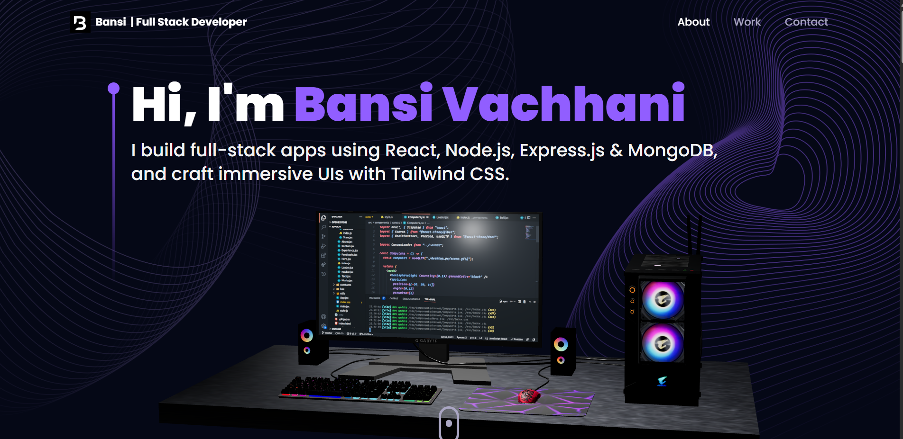

# 💼 Bansi Vachhani - Full Stack Developer Portfolio

Welcome to my personal developer portfolio website, built with **React.js**, **Tailwind CSS**, **Three.js**, and **Framer Motion**. This portfolio showcases my skills, projects, and experiences as a Full-Stack Web Developer.



---

## 🚀 Features

- ✨ Interactive Hero Section with 3D animations
- 🧠 About section highlighting skills and background
- 💼 Experience timeline with key responsibilities
- 🛠️ Tech Stack with icons
- 📂 Project showcase with live previews and source code links
- 🗣️ Testimonials from collaborators
- 📬 Contact form powered by **EmailJS**
- 🌍 EarthCanvas animation using Three.js

---

## 🛠️ Built With

- [React.js](https://reactjs.org/)
- [Tailwind CSS](https://tailwindcss.com/)
- [Framer Motion](https://www.framer.com/motion/)
- [Three.js](https://threejs.org/)
- [EmailJS](https://www.emailjs.com/)
- [React Three Fiber](https://docs.pmnd.rs/react-three-fiber/getting-started/introduction)

---

## 📸 Screenshots

| Hero Section | Projects | Contact |
|--------------|----------|---------|
|  |  |  |

---

## 🧑‍💻 How to Run Locally

```bash
git clone https://github.com/bansivachhani/your-portfolio.git
cd your-portfolio
npm install
npm run dev
